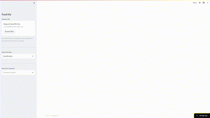

# Visual Exploration of Food Composition Data

## About the project

This tool is designed to help you analyze and gain valuable insights into nutritional components through intuitive data visualizations. The web app is built using:
- Streamlit: A powerful Python library for creating web applications.
- Plotly and Matplotlib: These libraries are employed for creating dynamic and visually appealing charts and graphs.
- Scikit-learn: The app incorporates Scikit-learn for natural language processing (NLP) and machine learning functionalities.

## Running the project online

Visit [Nutritional Data Visualization](https://nutritional-data-visualization.streamlit.app/) to access the app online without any local setup.

## Running the project locally

1. Create a virtual enviroment
   
```python -m venv env```
```source env/Scripts/activate```

2. Add dependencies
   
```pip install -r requirements.txt```

3. Run the project 
   
```streamlit run dashboard.py```

## Project Overview


